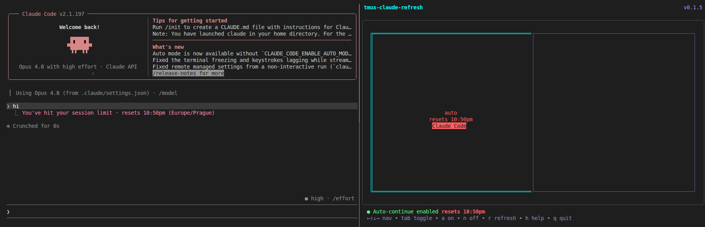

# tmux-claude-refresh



A TUI that watches tmux panes running [Claude Code](https://claude.com/claude-code) and automatically sends "continue" when a rate limit resets.

## Install

Latest release:

```bash
curl -sL https://github.com/robinpecha/tmux-claude-refresh/releases/latest/download/tmux-claude-refresh_linux_amd64.tar.gz \
  | sudo tar -xz -C /usr/local/bin tmux-claude-refresh
```

Pinned to a specific version (e.g. v0.2.0):

```bash
curl -sL https://github.com/robinpecha/tmux-claude-refresh/releases/download/v0.2.0/tmux-claude-refresh_0.2.0_linux_amd64.tar.gz \
  | sudo tar -xz -C /usr/local/bin tmux-claude-refresh
```

See all binaries (macOS, Linux, arm64) on the [Releases](https://github.com/robinpecha/tmux-claude-refresh/releases) page.

Requires `tmux`. Run it inside a tmux session:

```bash
tmux-claude-refresh
```

## Usage

1. Start `tmux-claude-refresh` in a tmux pane.
2. Move to a Claude Code pane with the arrow keys.
3. Press `tab` to enable auto-continue for that pane.
4. Leave it running — it sends `continue` when the rate limit resets.

### Keys

| Key | Action |
|-----|--------|
| `←↑↓→` | Navigate panes |
| `tab` | Toggle auto-continue |
| `a` | Auto-continue all Claude Code panes |
| `n` | Disable auto-continue on all panes |
| `r` | Refresh pane layout |
| `t` | Choose display timezone |
| `h` / `?` | Help |
| `q` | Quit |

### Pane colors

| Color | Meaning |
|-------|---------|
| Orange | Claude Code (auto-continue off) |
| Green | Claude Code (auto-continue on) |
| Red | Rate limited (waiting for reset) |
| Cyan | Selected pane |

## How it works

1. Polls tmux panes every 3 seconds.
2. Detects Claude Code by its UI patterns.
3. Parses the reset time from the rate-limit message.
4. When the time passes, sends `Escape` → `continue` → `Enter`.

## Timezone

Reset times are displayed in your chosen timezone. Claude embeds its own timezone in the rate-limit message (e.g. `resets 10pm (Europe/London)`); tmux-claude-refresh reads that, converts the instant correctly, and shows it in your timezone — e.g. `resets 11pm (Europe/Prague)`.

Press `t` in the TUI to open a searchable timezone picker. Type to filter, `↑↓` to navigate, `enter` to select. Your choice is saved to:

```
~/.config/tmux-claude-refresh/config
```

with a single line:

```
timezone = Europe/Prague
```

If the file is absent or the timezone is invalid, it falls back to your system local time.

## Development

```bash
go test ./...
go build
```

## License

MIT — see [LICENSE](LICENSE). Original work by [Henry Stanley](https://henrystanley.com).
